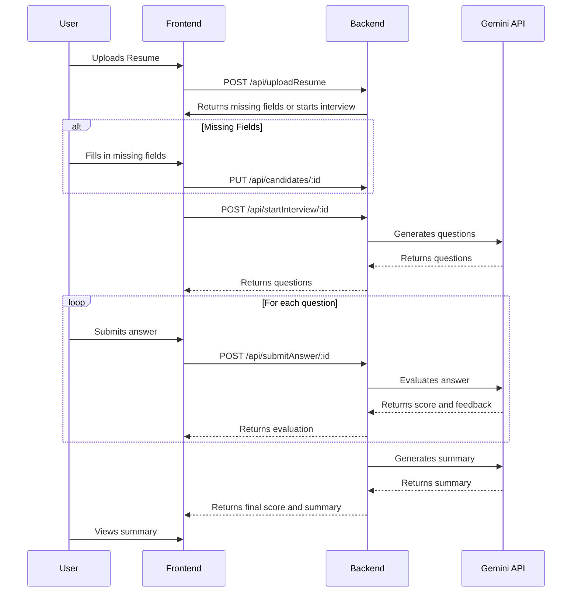

# Smart Interview

AI-powered interview assistant that generates questions based on a candidate's resume, evaluates their answers, and provides a summary of their performance.

## Features

- Resume parsing (PDF and DOCX)
- Automatic extraction of candidate information (name, email, phone)
- Dynamic question generation based on resume content
- Timed interview questions with varying difficulty levels
- AI-powered evaluation of answers with scores and feedback
- Detailed interview summary and final score
- Dashboard for interviewers to view and compare candidates

## Tech Stack

- **Frontend:** React, Redux, Ant Design
- **Backend:** Node.js,, Express, MongoDB, Mongoose
- **AI:** Google Gemini API

## Architecture



## Getting Started

### Prerequisites

- Node.js (v14 or later)
- npm
- MongoDB

### Installation

1. **Clone the repository:**

   ```bash
   git clone <repository-url>
   cd smart-interview
   ```

2. **Install server dependencies:**

   ```bash
   cd server
   npm install
   ```

3. **Install client dependencies:**

   ```bash
   cd ../client
   npm install
   ```

### Configuration

1. **Set up backend environment variables:**

   - Create a `.env` file in the `/server` directory.
   - Add the following variables:

     ```
     PORT=5000
     MONGODB_URI=<your_mongodb_connection_string>
     GEMINI_API_KEY=<your_gemini_api_key>
     CLIENT_URL=http://localhost:3000
     ```

2. **Set up frontend environment variables:**

   - Create a `.env` file in the `/client` directory.
   - Add the following variable:

     ```
     VITE_API_URL=http://localhost:5000/api
     ```

### Running the Application

1. **Run the backend server:**

   ```bash
   cd server
   npm start
   ```

2. **Run the frontend client:**

   ```bash
   cd client
   npm run dev
   ```

The client will be available at `http://localhost:5173` and the server at `http://localhost:5000`.